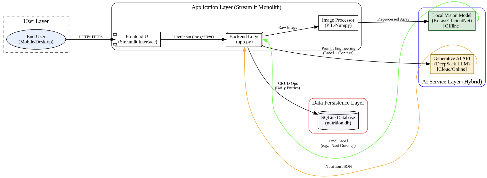
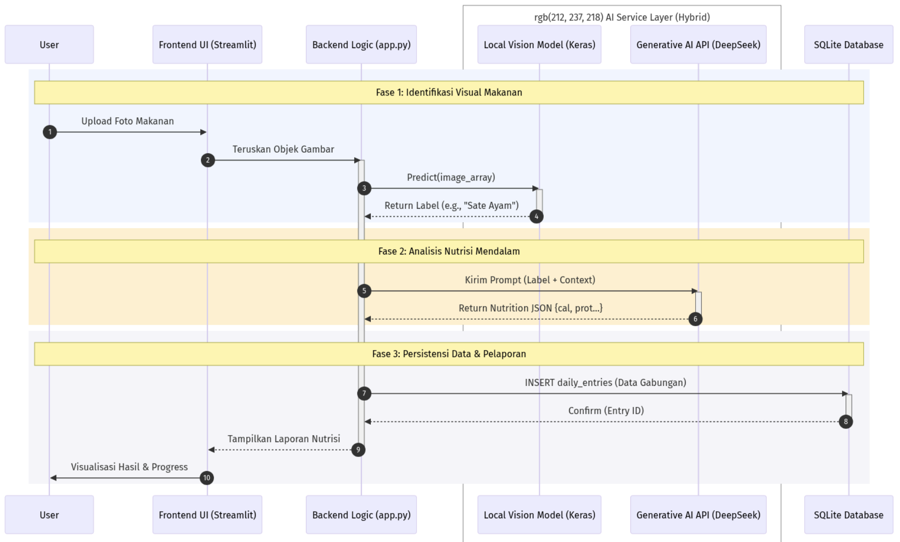
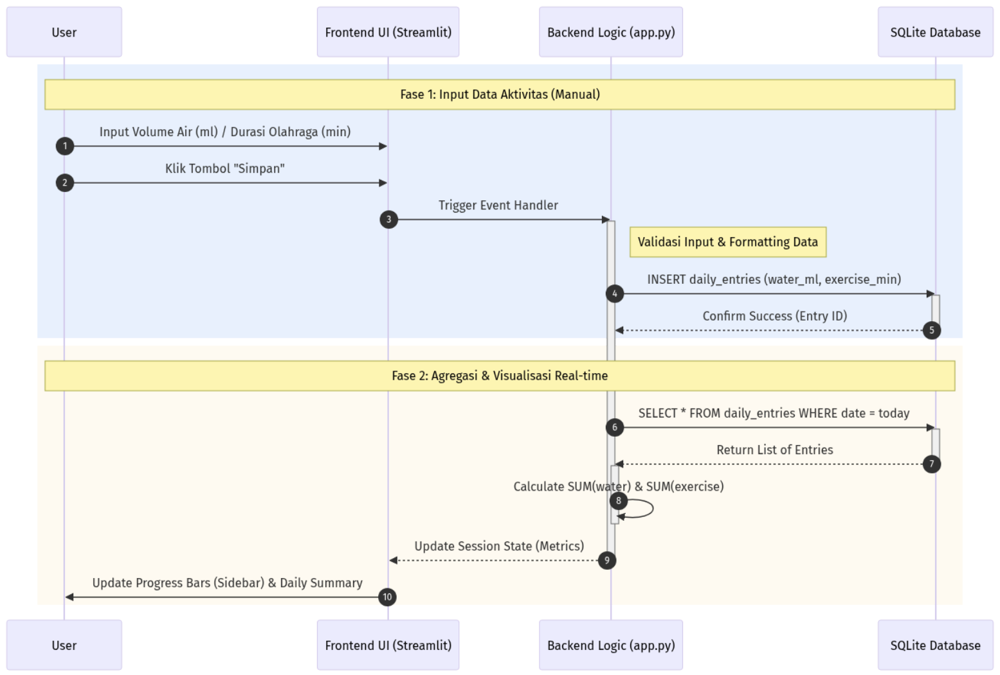
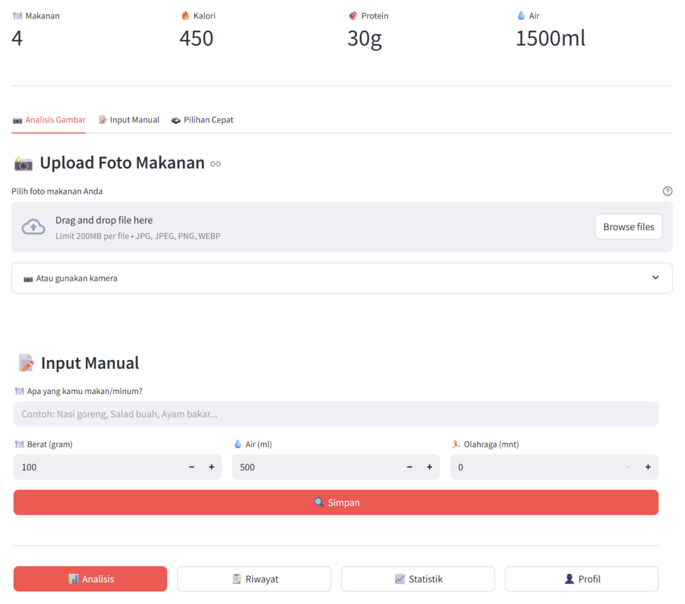
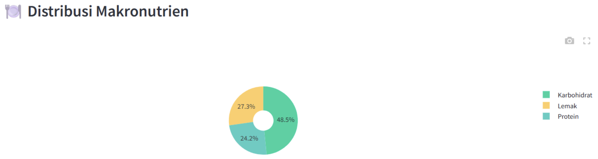
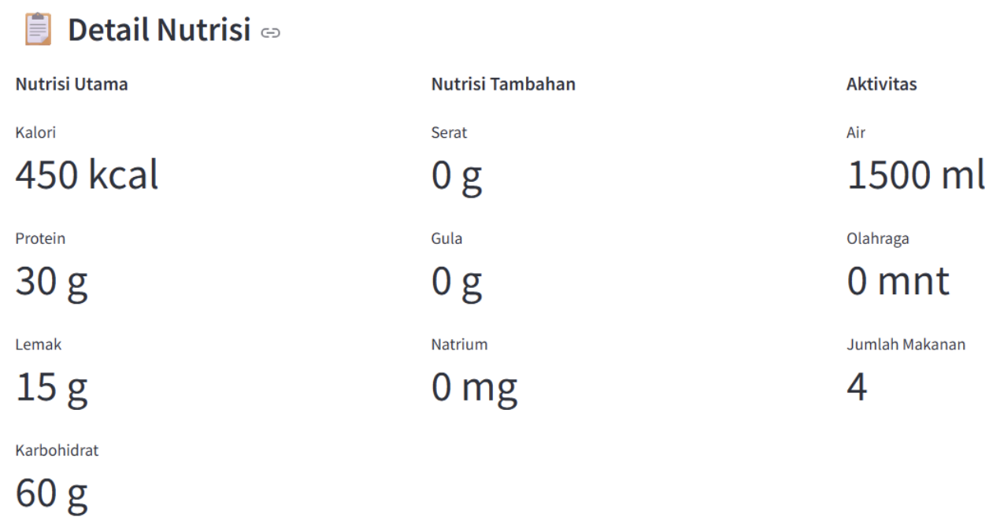

# NutriScan AI: Hybrid Intelligence Nutrition Platform

[](https://www.python.org/)
[](https://streamlit.io/)
[]()
[]()

**NutriScan AI** is a web-based platform designed to automate nutrition tracking using a **hybrid-AI** approach. It combines **EfficientNetB0** (local vision model) for instant food recognition and **DeepSeek LLM** (generative AI) for comprehensive nutritional analysis, reducing the cognitive load of manual food logging.

---

## Key Features

* **Visual Food Recognition:** Instantly detects 127 food classes (Indonesian and Western cuisine) using a fine-tuned EfficientNetB0 model.
* **Generative Nutrition Analysis:** Utilizes DeepSeek API to estimate calories, protein, fat, and carbs based on visual context.
* **Hydration & Activity Tracker:** Integrated logging for water intake and exercise duration.
* **Daily Analytics:** Real-time visualization of daily progress against health goals using interactive charts.

---

## System Architecture

The system follows a modular monolithic architecture, integrating a Streamlit frontend with a Python controller logic that orchestrates AI services and SQLite persistence.



### Data Flow Pipelines
*Note: The flowcharts below contain Indonesian labels. English explanations are provided below each diagram.*

#### 1. Image-to-Nutrient Extraction Pipeline
This pipeline converts unstructured image data into structured nutritional JSON.



* **Phase 1 (Identifikasi Visual):** Image is preprocessed and sent to the local Keras Model. The model returns the predicted label.
* **Phase 2 (Analisis Nutrisi):** The label is sent to DeepSeek LLM with a specific prompt to act as a nutritionist.
* **Phase 3 (Persistensi):** The LLM returns raw JSON data, which is parsed and saved to the SQLite database (`daily_entries`).

#### 2. Activity & Hydration Tracking Pipeline
Logic for cumulative daily tracking (water & exercise).



* **Fase 1 (Input):** User inputs water (ml) or exercise (min). Data is validated by `app.py`.
* **Fase 2 (Agregasi):** The system queries the database (`SELECT SUM...`) to aggregate today's total and updates the progress bars in real-time.

---

## Dataset & Methodology

To ensure relevance to the local context, we constructed a **multi-source dataset** comprising **114,080 images** across **127 food classes**.

* **Core:** Food-101
* **Enrichment:** Integrated 4 local datasets (Kaggle/Mendeley) for Indonesian foods (e.g., *Rendang, Gado-gado*)
* **Imbalance Handling:** Implemented cost-sensitive learning (inverse class frequency weights) to prevent bias toward majority classes
* **Augmentation:** Random flip, rotation (±72°), zoom (±20%), and photometric adjustments

---

## Model Performance (EfficientNetB0)

We evaluated three architectures (EfficientNetB0, MobileNetV3, ResNet50). **EfficientNetB0** was selected as the final model due to its superior generalization capabilities.

### 1. Architecture Comparison
| Rank | Model Architecture | Test Accuracy (Top-1) | Gap to Best |
| :--- | :--- | :--- | :--- |
| 🥇 | **EfficientNetB0** | **70.47%** | **-** |
| 🥈 | MobileNetV3 Large | 68.96% | -1.51% |
| 🥉 | ResNet50 | 62.15% | -8.32% |

### 2. Detailed Metrics (EfficientNetB0)
The selected model demonstrates high reliability, with the correct label appearing in the top-5 predictions **92.48%** of the time.

| Metric | Score | Interpretation |
| :--- | :--- | :--- |
| **Top-1 Accuracy** | 70.47% | Correctly identifies the exact food item. |
| **Top-5 Accuracy** | 92.48% | Correct label is within the top 5 probabilities. |
| **Macro Precision** | 0.71 | Low false positive rate across classes. |
| **Macro Recall** | 0.72 | High sensitivity in detecting relevant objects. |
| **Macro F1-Score**| 0.71 | Balanced performance between precision and recall. |

---

## Application Preview

| **1. Input Dashboard** | **2. Daily Summary - Macronutrient Distribution** |
| :---: | :---: |
|  |  |
| *User uploads image, adjusts portion (g), then inputs hydration and exercise duration.* | *Breakdown of protein, fat, and carbs proportion.* |

| **3. Daily Summary - Nutrient and Activity Details** | |
| :---: | :---: |
|  | |
| *Detailed view including water intake and exercise duration.* | |

---

> **Documentation Note:**
> The complete technical report for this project is available in Indonesian.
> **[Download Full Report (Bahasa Indonesia)](Full_Report_Indonesian.pdf)**

---

## Limitations & Future Work

While NutriScan AI successfully automates nutrition tracking, there are specific limitations identified that guide our future development.

### Current Limitations
1.  **Dependency on External Gen-AI:** The system currently relies on the third-party DeepSeek API for nutritional reasoning. It does not yet utilize a proprietary or locally fine-tuned Generative AI model.
2.  **Manual Portion Estimation:** The system lacks the capability to perform volumetric analysis. Users must manually input or adjust portion sizes (in grams) rather than having the AI estimate weight directly from the 2D image.
3.  **Limited Recognition Scope:** The Local Vision Model is optimized specifically for 127 food classes. Foods outside this specific training distribution may experience lower detection accuracy.

### Future Work
To address the limitations above, the next development phase will focus on:
1.  **Development of In-House Gen-AI:** Fine-tuning an open-source small language model (SLM) specifically for nutritional analysis to run locally, eliminating the reliance on external APIs.
2.  **Automated Volumetric Estimation:** Implementing depth-estimation algorithms or reference-object calibration to automatically calculate food volume and mass from images.
3.  **Dataset Expansion:** Continuously expanding the training dataset to include a wider variety of international and local cuisines to improve the generalization of the vision Model.

---

## Installation & Usage

### Prerequisites
* Python 3.10+
* Git

---

### 1. Clone Repository
```bash
git clone [https://github.com/CrystalySwift/NutriScan-AI.git](https://github.com/CrystalySwift/NutriScan-AI.git)
cd NutriScan-AI
``` 

### 2. Download Model (Required)  
Due to GitHub's file size limits, the pre-trained EfficientNet model (`best_food_effnet.keras`) is hosted externally.

1. **[CLICK HERE TO DOWNLOAD MODEL]** (https://drive.google.com/file/d/14jUVP-ys6k6KTlSyd09gDjVIARg9e0_g/view?usp=sharing)
2. Once downloaded, place the file in the root directory of the project (inside the `NutriScan-AI` folder).

> **Note:** The application will fail to run if this file is missing or placed in the wrong folder.

### 3. Install Dependencies
Install the required Python packages:
```bash
pip install -r requirements.txt
